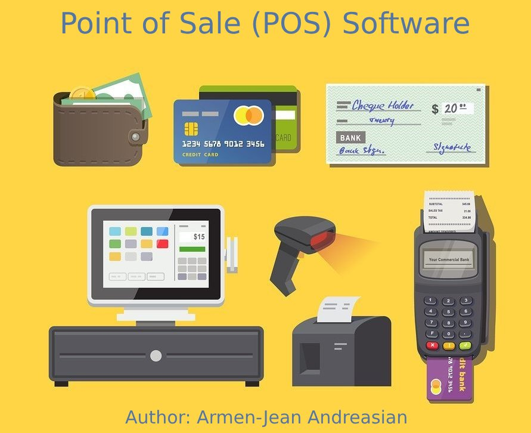
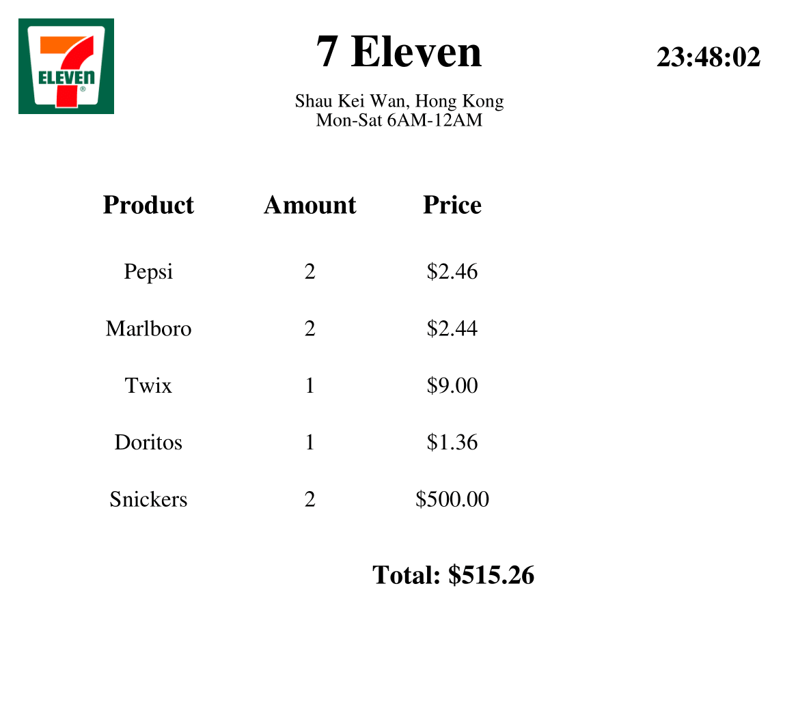

# Point of Sale (POS) Software

## Description

This Point of Sale (POS) software project is designed to streamline the sales process for businesses. It offers a user-friendly interface that allows for quick product identification, whether through manual input or barcode scanning (depending on the store's setup). The software connects to a MySQL database to retrieve item details such as ID, name, and price, enabling accurate and efficient transaction processing.

One of the key features of this software is its ability to generate itemized receipts, displaying product names, quantities, and prices per item. It calculates and displays the total amount to be paid, providing a comprehensive summary for both the cashier and the customer. Additionally, the software automatically generates PDF receipts, making it easy to print and adapt to various receipt printing machines.

## Features
- **Efficient Product Identification:** Users can quickly identify products either through manual input or barcode scanning, depending on the store's setup and equipment.

- **Database Integration:** The software seamlessly integrates with a MySQL database to fetch essential item details such as ID, name, and price, ensuring accurate and up-to-date product information.

- **Itemized Receipts:** It generates itemized receipts that provide a detailed breakdown of the purchased items, including product names, quantities, and individual prices.

- **Total Amount Calculation:** The software calculates and displays the total amount to be paid, simplifying the payment process for both cashiers and customers.

- **PDF Receipt Generation:** Automatic PDF receipt generation allows for easy printing and adaptation to various receipt printing machines, enhancing convenience and professionalism.

- **Customization:** Users have the option to customize supermarket information, including the name, address, operating hours, and even the supermarket logo.

- **Stock Management:** The software enables staff to add new items to the store's inventory, ensuring that the product database is always up to date.

- **User-Friendly Interface:** The POS software offers an intuitive and user-friendly interface that facilitates smooth and efficient sales transactions.

- **Printable Receipts:** Receipts can be easily printed for customer records and accounting purposes.

- **Cross-Platform Compatibility:** Built using Python, the software can run on various platforms, making it adaptable to different hardware configurations.

- **PDF Receipt Storage:** Generated PDF receipts are organized and stored in designated folders, making it easy to access historical sales data.

- **Convenient Reporting:** Users can check available products and generate PDF stock reports for better inventory management.

- **Data Security:** The software ensures data security and integrity when accessing and updating the MySQL database.

---
## Receipt Example

## Report Example

Here is an example of a stock report generated by the POS software:

---

## Technologies Used

- **Programming Language:** Python
- **Database:** MySQL
- **PDF Generation:** [FPDF Library](https://pyfpdf.readthedocs.io/en/latest/)
- **Barcode Scanning:** (manual input for now)

## Author
- ### *Author name:* Armen-Jean Andreasian
- ### *Author's* [*GitHub*](https://github.com/Armen-Jean-Andreasian)